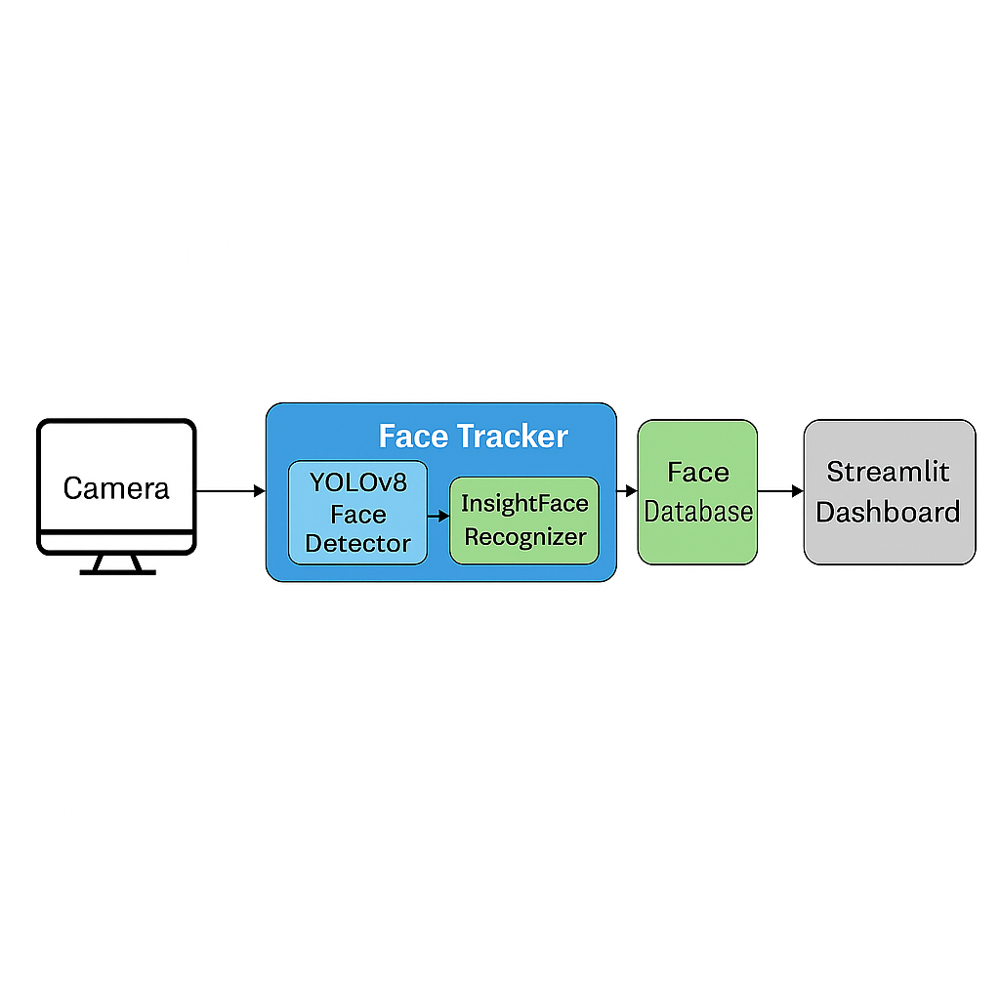
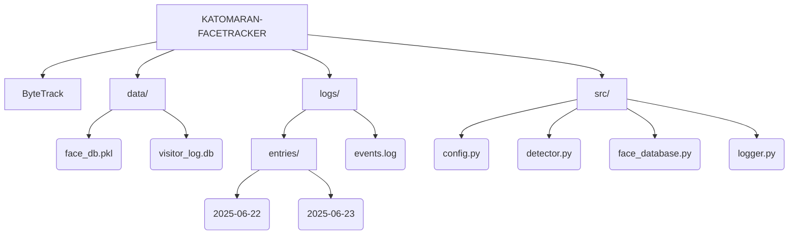

# 🎯 Intelligent Face Tracker with Auto-Logging & Dashboard
 

This project is a real-time face tracking and visitor logging system using YOLOv8 for face detection, InsightFace for recognition, and ByteTrack for tracking. It logs all events (entry, re-detection, exit) with cropped images and timestamps into a structured SQLite database. A Streamlit dashboard enables easy monitoring and filtering.

---
 
 
 

## 🛠️ Setup Instructions

### 1. Clone the Repository

<pre>git clone https://github.com/your-username/katomaran-facetracker.git
cd katomaran-facetracker</pre>

### 2. Create & Activate Virtual Environment

<pre>python -m venv venv
venv\Scripts\activate  # For Windows</pre>

### 3. Install Requirements

<pre>pip install -r requirements.txt</pre>

### 4. Download InsightFace Models (auto on first run)

<pre>from insightface.app import FaceAnalysis
app = FaceAnalysis(name="buffalo_l")
app.prepare(ctx_id=0)</pre>
 
 
 

# 📚 Assumptions Made

Faces detected by YOLOv8 are assumed to be frontal and clear enough for InsightFace.

Face recognition is based on cosine similarity threshold from normed_embedding.

SQLite database is used and stores logs locally in data/visitor_log.db.

Each day has its own log/image folder: logs/entries/YYYY-MM-DD/.

CPU-only mode (CPUExecutionProvider) is used for deployment simplicity.
 
 
 

# 🧠 Application Architecture

 ## Architecture Diagram

 
 
 

# Sample config.json

{
  
    "DB_PATH": "data/visitor_log.db",
    "FACE_DB_PATH": "data/face_db.pkl",
    "SIMILARITY_THRESHOLD": 0.6,
    "DETECTION_SKIP_FRAMES": 5,
    "LOG_DIR": "logs",
    "YOLO_MODEL_PATH": "yolov8n-face.pt",
    "MIN_CONFIDENCE": 0.5

}
 
 
 

# Project Structure

 
 
 
# Streamlit Dashboard

## Run the dashboard with:

<pre>streamlit run dashboard.py</pre>

### Filter logs by date or event type

### Visualize event counts with bar chart

### View cropped face images and timestamps

### Launch face tracker from UI
 
 
 

# Demo Video

<pre>https://www.loom.com/share/132b5701196346c3a84df327ff99220e?sid=56585562-984c-49a0-9708-d5ed4afaec59</pre>

 
 
 

# Sample Output

Database (SQLite): data/visitor_log.db

Table: visits(face_id, event_type, timestamp, image_path)

Face Crops: Saved under logs/entries/YYYY-MM-DD/

Log File: Plain text logs in logs/events.log
 
 
 

# How to Run

1.Start Face Tracker

<pre>python insig_bt.py</pre>

2.Launch Dashboard

<pre>streamlit run dashboard.py</pre>
 
 
 

# Key Features

🔍 YOLOv8 for robust face detection

🧠 InsightFace for fast face recognition

🧾 Automatic event logging to SQLite

📷 Cropped face images stored and visualized

📊 Dashboard filters and bar chart

🧠 Redetection + exit logic using ByteTrack

 
 
 

# 📌 Final Note

This project is a part of a hackathon run by https://katomaran.com